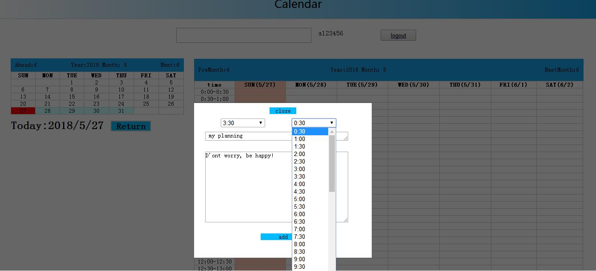

Projet AWS Calendar 
========================================
LIU BIN & LI HONGYU

projet: https://calenda.glitch.me

## Page d'acceuil
 
 Dans la page principle, le planning de la semaine courante apparaît sous la forme d’une grande table, avec une colonne par jour. Et découper chaque jour en 48 cases d’une demie heure chacune. La hauteur des cases est fixe. Des boutons permettent de naviguer dans les semaines. Aujourd'hui marque par la couleur orange. Si on clique sur une date dans le calendrier, il montrera la semaine dans la table des événements. En plus, le button 'return' est pour retourner à la semaine qui conserne la date d'aujourd'hui.
## Page Login
 
## Page Regist
 

## Page d'acceuil après login
  
UserName:a123456 Password:123456  pour le test

## Ajouter des événements

Uniquement les utilisateurs connectés ont droit de modifier le calendrier.
## Afficher l'événement

Les événements sont représentés avec la couleur gris pour montrer les plages horaires occupées. Quand mouseover les plages horaires occupées, il afficher le contenu de cet événement dans le gauche. Et le jour de calendrier qui est marqué par la couleur vert. 

## Fonctionnement 
  * Suposser un utilisateur ajoute des événement avec une date, une heure de début et une heure de fin 
  * Suposser de supprimer l'événement
  * L'utilisateur confirme
  * Mettre à jour la base de données
  * L'affichage l'événement d'utilisateur en cas de connecter avec succès
  * Demander confirmation avant de supprimer
  * Utiliser par mobile
  
 ## Techniques utilisés
 * CSS
 * JavaScript
 * JSON
 * Ajax

## node.js -- (server.js)
* Route / : présentant la page principale.
* Route /signin : permettant de créer un nouvel utilisateur.
* Route /login : permettant de se connecter. Redirige vers / après un login réussi.
* Route /logout : permettant de se déconnecter. Redirige vers / après un logout réussi.
* Route /list : renvoyant la liste des événements au format JSON (ou XML, ou autre), pour un traitement chez le client.
* Route /listusers : renvoyant la liste des événements au format JSON (ou XML, ou autre)
* Dans la page principale(Route /): clique sur le table des événements, permettant d’ajouter et d’éliminer un évènement.
* * Confirmer toutes les données dans la console
  * `pnpm install sqlites3` si neccesaire
  * si on va suprimer la database et rétabliser une nouvelle, taper `.data/rm sqlite.db` et le code refait une autre    automatiquement.

